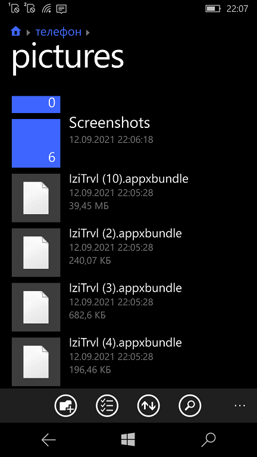
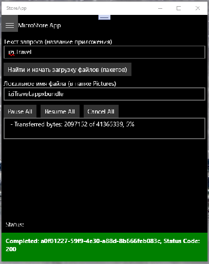

# StoreApp v0.2-beta - A mini-app for direct downloading from MS Store!

StoreApp is a MS Store micro-clone using .Net Standard written in C#. 
This project started initially as a nighits/weekend project of mine to better understand 
MS Store "System". =)

# Screenshots

The goals for this project were simple:
- Write my first multi-threading UWP app using C#
- Learn the inner workings of MS Store "entity"
- Start to structure my code to match atomaric tasks as possible
- Write the code in a way that made it readable and easier to understand for someone wanting to learn as I was
- Use .Net Standard & Microsoft COmmunity Toolkit to make the app more "modular(able)" 

## What's new 

v0.2-beta:
- Russian localization (main ui controls only)
- Min os build now is 14393 (old value was 15063)
- Multipackage ARM + x64

## Contribute!
There's still a TON of things missing from this proof-of-concept (MVP) and areas of improvement 
which I just haven't had the time to get to yet.
- Performance Improvements
- Additional Package choose
- Media Support: screenshots, etc. (for the brave)

## Solution Layout
Projects have a README.MD which expands on the internal functionality and layout of that project. 

A brief summary of each project is as follows:
- **[StoreApp.StoreApp](./StoreApp/StoreApp/)** - The main Store UI and some simple logic
  - All components are integrated into this project
  - This has StoreLib reference
- **[StoreApp.StoreLib](./StoreApp/StoreLib/)** - Library for MS Store connection
  - search packages
  - make package urls for direct downloading
  - some cool helpers (i.e., app screnshots' url getter)
- **[StoreApp.Tasks](./StoreApp/Tasks/)** - Background Tasks
  - Tasks support
  - Async + mutli-thread mode

There are also a couple DOCs which explains miscellaneous functionality. =)

With best wishes,

  [m][e] 2021

## Thanks!
I wanted to put down some thank you's here for folks/projects/websites that were invaluable 
for helping me get this project into a functional state:
- [TitleOS](https://github.com/TitleOS) - StoreLib and StoreWeb creator/author
- [StoreLib](https://github.com/StoreDev/StoreLib) - DotNet library that provides APIs 
to interact with the various Microsoft Store endpoints.
- [StoreWeb](https://github.com/StoreDev/StoreWeb) - An interface for StoreLib created in ASP.NET

## License & Copyright

StoreApp is RnD project. AS-IS. No support. Distributed under the MIT License. 